<p align="center">
  
</p>

<p align="center">
  <em>A local-first personal finance dashboard for the unified picture of your cross-account money.</em>
</p>

<p align="center">
  
  
  
  
</p>

<p align="center">
  <strong>🇬🇧 English</strong> · <a href=".docs/translations/readme/nl-NL.md">🇳🇱 Nederlands</a>
</p>

## What is beatrax?

beatrax is a local-only personal finance dashboard that pulls together
transactions from ASN Bank, ICS Cards, PayPal, and Google Play into a
single calm "this month at a glance" view. It resolves the routing
chains between these accounts (PayPal → ASN or ICS, ICS → ASN via bulk
iDEAL settlement) so that fixed monthly payments, real underlying
funding sources, and upcoming cash flow are visible in one place
instead of buried across statements.

It runs entirely on your own machine. No telemetry. No cloud sync. No
remote account. The SQLite database, the OAuth tokens, the cached
email receipts — all live on your disk and never leave it unless you
choose to export them yourself.

The product is **source-available**, not open-source in the OSI sense.
The full source is here for you to read, run, and modify; the license
adds ethical-use clauses on top of that. See [NOTICE.md](NOTICE.md) for
the longer explanation.

## Who is this for?

beatrax is built for a single person — or a two-person household —
managing their own finances across multiple Dutch bank, card, and
payment-processor accounts who wants to see their monthly position in
one place instead of cobbling together statements every cycle. It
assumes you are technically literate enough to install a desktop
application, grant OAuth permission to your Gmail or Microsoft Graph
inbox if you want email-receipt scanning, and read a CSV or PDF when
you need to.

If you bank exclusively with one institution that already gives you a
great app, you probably don't need beatrax. If you split your spending
across ASN + ICS + PayPal + recurring Google Play subscriptions and
have given up on reconciling them by hand, this is for you.

## Shoutouts

### Thanks, mom
I want to start off with thanking my mom (Bea - for anyone who wondered where the name was based on), who's been the inspiration for making this.

### Get Shit Done (GSD) / Claude Code

There's a few things I wanted to try out with this project, and one of them was doing everything through prompting, and the quality of what can be delivered is amazing with GSD and Claude. Check GSD out here: https://github.com/gsd-build/get-shit-done

### Laravel / NativePHP

Among alot of other amazing packages (and for sure check out the composer.json), I'd like to highlight Laravel and NativePHP - it's amazing how far the PHP language has come in the last few years, and what you can do with it.

## Install

beatrax ships installers for macOS, Windows, and Linux. Pick the one
for your platform.

### Installing on macOS

beatrax is an independent app. macOS will warn you the first time you
open it — that's expected.

1. Open the downloaded **beatrax.dmg** and drag beatrax into your
   Applications folder.
2. Right-click **beatrax** in Applications and choose **Open**.
3. When macOS asks "are you sure?", click **Open**.
4. From now on, double-clicking beatrax launches it normally.

**Alternative (Terminal one-liner):**

```sh
xattr -d com.apple.quarantine /Applications/beatrax.app
```

> Like most independent macOS apps, beatrax isn't signed with an Apple
> Developer ID — we don't pay Apple $99/year just to avoid the
> first-launch dialog. [Why we made this choice →](.docs/legal/license-rationale.md#no-paid-signing)

### Installing on Windows

beatrax is an independent app. Windows SmartScreen will warn you the
first time you open it — that's expected.

1. Run the downloaded **beatrax-setup.exe**.
2. When you see "Windows protected your PC", click **More info**.
3. Click **Run anyway**.
4. From now on, beatrax launches normally from the Start menu.

> SmartScreen reputation builds up over time as more people open
> beatrax. After a few weeks, the warning will stop appearing for new
> users automatically. [Why we made this choice →](.docs/legal/license-rationale.md#no-paid-signing)

### Installing on Linux

beatrax ships as both an AppImage (portable) and a .deb (Debian /
Ubuntu native).

**AppImage:**

```sh
chmod +x beatrax-*.AppImage
./beatrax-*.AppImage
```

**.deb (Debian / Ubuntu / Mint):**

```sh
sudo dpkg -i beatrax-*.deb
```

### Verifying the download

Every release publishes SHA-256 checksums and an Ed25519-signed
manifest. If you'd like to verify integrity:

```sh
sha256sum beatrax-{version}-{platform}.{ext}
```

Then compare against the checksum file published with the release. For
the deeper "is this manifest authentic?" check, see
[the verification runbook →](.docs/runbooks/verify-release.md).

## Screenshots

A walk through the app — most are short gifs that step through 2–3
distinct states, the rest are stills.

### Setup wizard

A seven-step first-run flow: welcome → bank → PayPal → ICS card →
email → review & commit → done. Each connector step is skippable so
you can come back to it later from Settings.

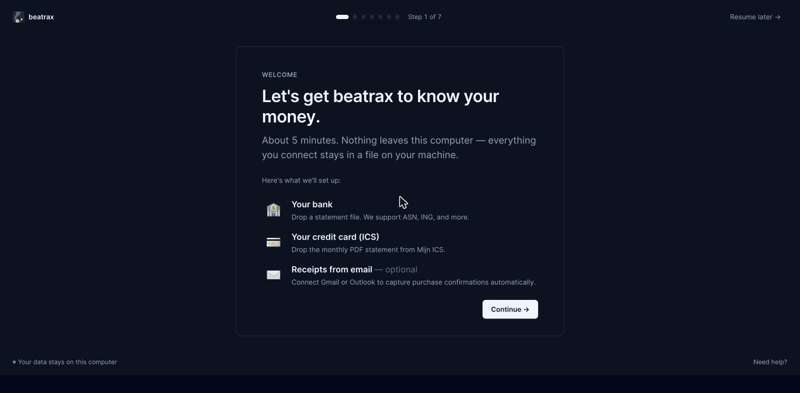

### Dashboard

The "this month at a glance" view with the cash-flow forecast
highlight, in/out/net at the top, drift alerts, and email-scan health.

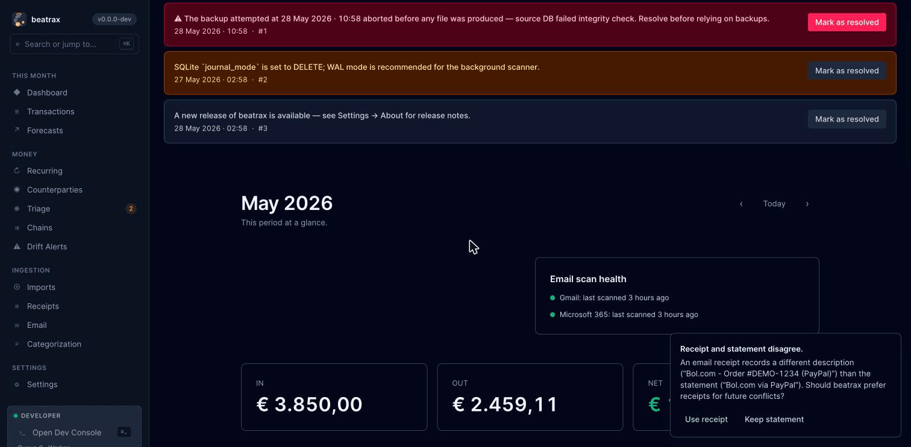

### Transactions

Browse, filter, and recategorize inline. Flip between **EUR only** and
**Original currency** to reveal what a charge really cost — Google
Play settles in USD but the ASN charge is in EUR, and the toggle shows
both.

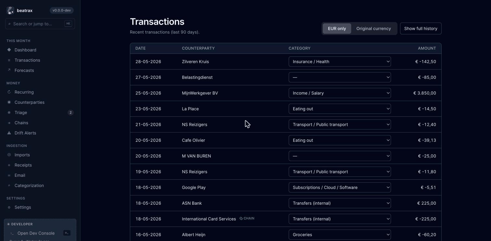

### Categorization

A keyboard-driven inbox for transactions that landed without a category.
Pick a category per row (1–9 hotkeys assign the top categories,
arrow-keys move, Enter saves), then **Save categories** commits the
batch — and the rules ripple out to similar future imports.

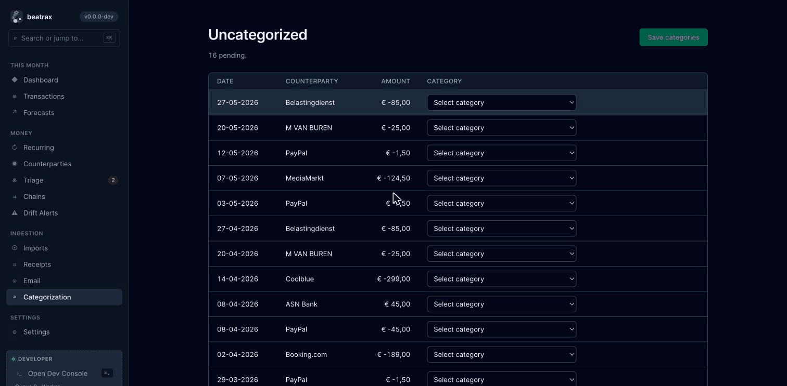

### Counterparties

Every merchant, bank, person, or self-account that has ever moved
money in or out — with type chips, 12-month totals, average per
month, and a sparkline of recent activity. Drill in for the full
profile, recent transactions, aliases, and any detected funding
chain.

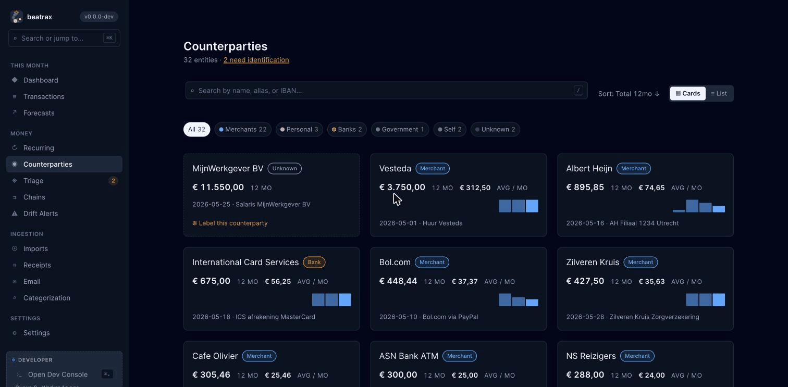

### Triage

When a transaction belongs to an IBAN beatrax has never seen, it lands
here as an unknown counterparty with its recent activity. Type a
display name, pick a type (Merchant / Personal / Bank / Government /
Self), and one keystroke labels every transaction sharing that IBAN.

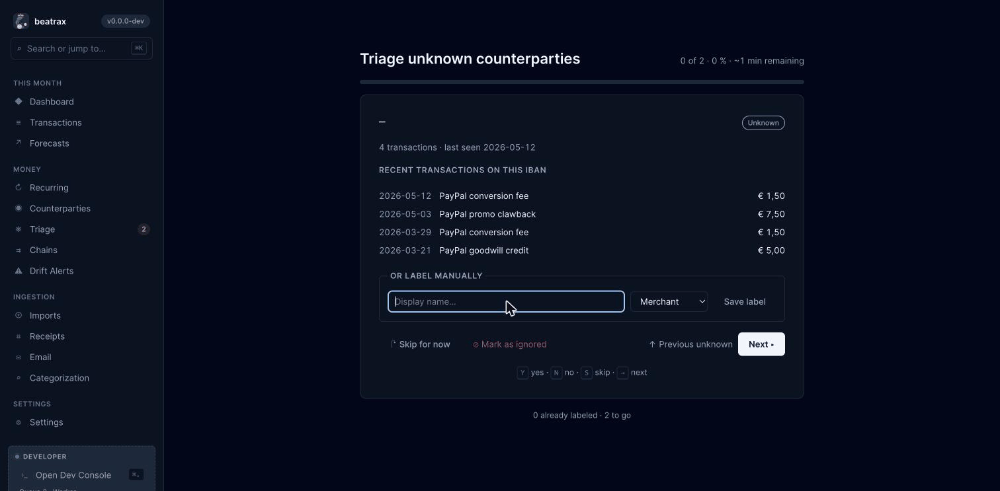

### Recurring

Approved subscriptions and fixed payments at a glance, with the
monthly total computed across currencies. Each series opens a detail
page with an amount-over-time chart and every occurrence.

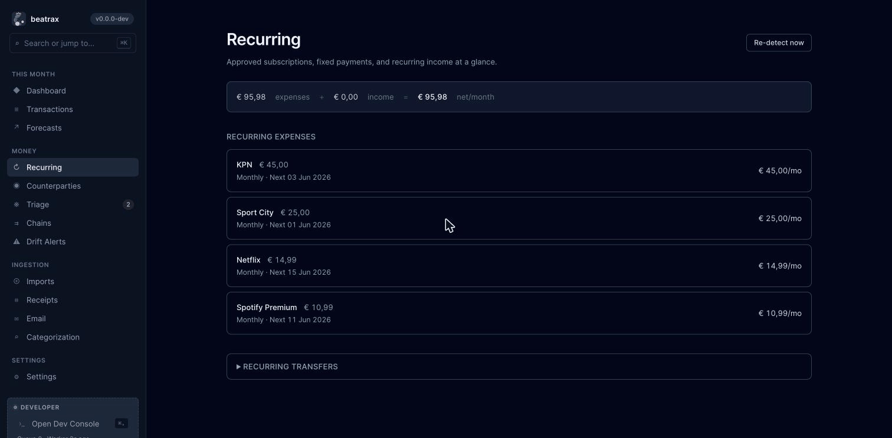

### Drift alerts

Approved recurring series whose latest charge moved outside your
threshold land here — with prior → current amounts, annualized
impact, and quick actions (acknowledge, snooze, model a cancellation,
or mark as already-cancelled). Acknowledged alerts flow into
**History**.

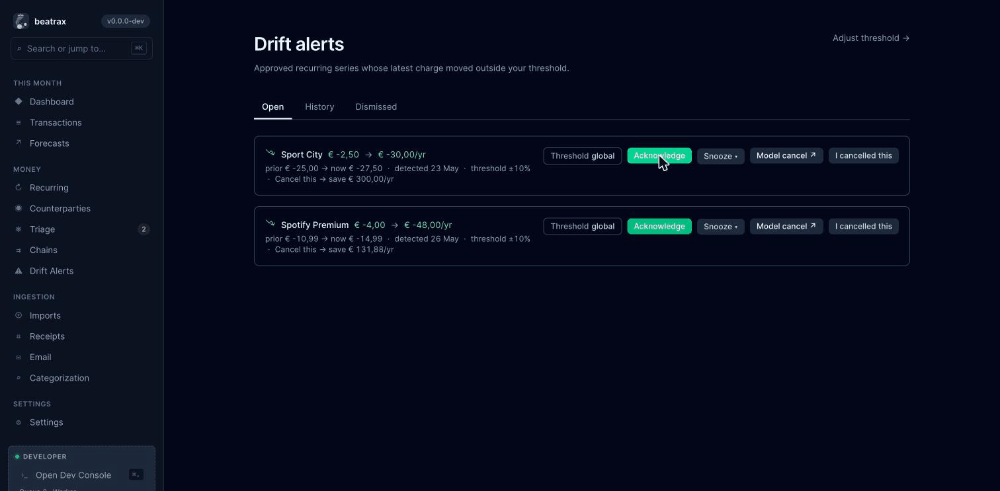

### Forecast

30 / 60 / 90-day cash-flow projection across every account. Toggle
between the aggregate line and per-account range-area charts, and
overlay what-if scenarios (e.g. a summer-holiday cash outflow) to see
the dip before it happens.

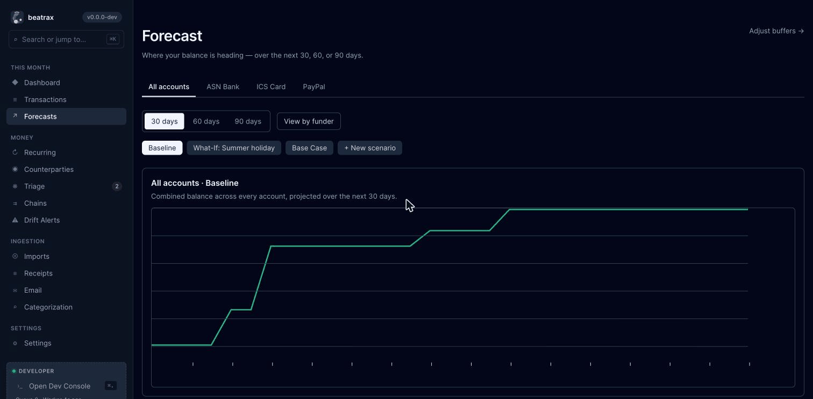

### Chains review

PayPal → ASN and ICS → ASN funding-chain resolutions, so you can see
what really paid for what.

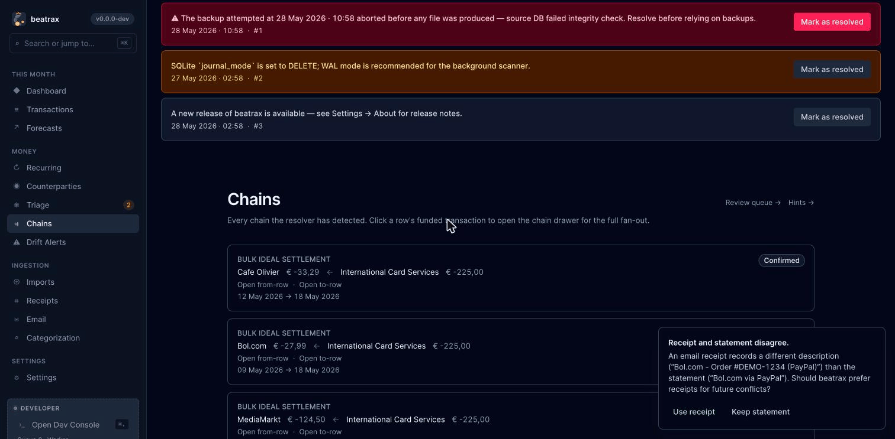

### Command palette

`⌘K` from anywhere to jump to a page, run a command, or invoke an
action. Type-ahead filters across views, dev commands, and actions —
artisan commands, system snapshot, profile, and more.

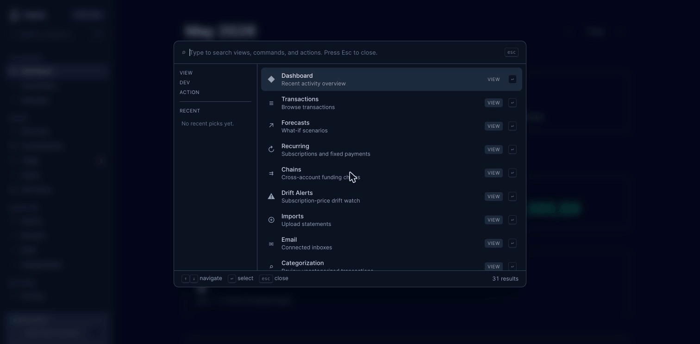

### Dev Console

The diagnostic panel for inspecting ingestion state, queue health,
SQL, logs, and the SQLite WAL — only visible when developer mode is
on.

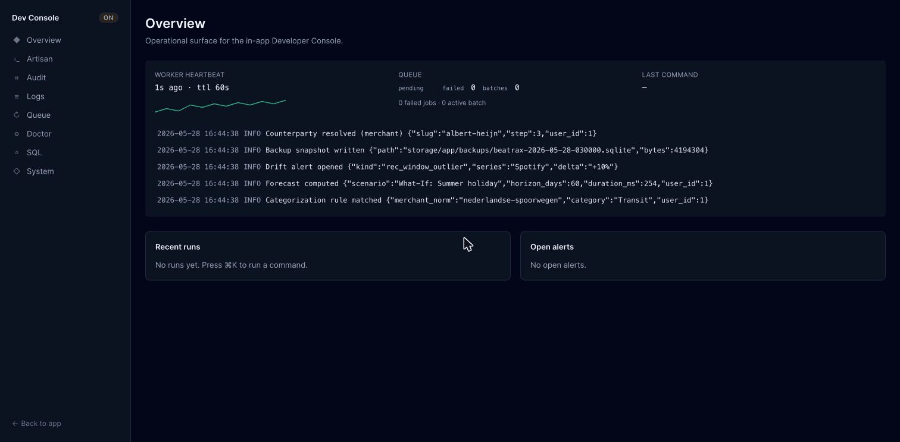

Contributors capturing fresh screenshots can populate a representative
demo dataset with `php artisan demo:seed --reset` once that command
lands in an upcoming release.

## Project status

beatrax is in active development on the v0.x line. The shape and
behaviour visible in this repository today is the work that the v1.0.0
release will bundle. See the release page on GitHub for the latest
download.

## Contributing

See [CONTRIBUTING.md](CONTRIBUTING.md).

## License + ethics

beatrax is licensed under the [Hippocratic License 3.0](LICENSE). It's
source-available, not OSI-approved — see [NOTICE.md](NOTICE.md) for the
rationale.

## Security

Report vulnerabilities via [Security Policy](SECURITY.md).
